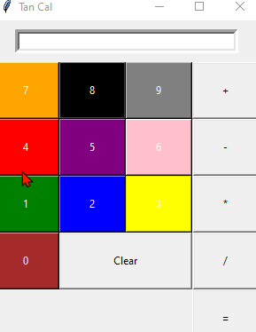

# Calculator
Simple Calculator

# Project 1 - *Calculator*

Submitted by: **Zhuohao Tan**

Time spent: **1** hours spent in total

## User Stories

The following **required** functionality is completed:

* [x] User can **view all the buttons**
* [x] User can **add, multiply, divide, and mins the nubmers** in the calculator

## Video Walkthrough

Here's a walkthrough of implemented user stories:

GIF created with [LiceCap](http://www.cockos.com/licecap/).

## Notes

Typing out the layout for each buttons
